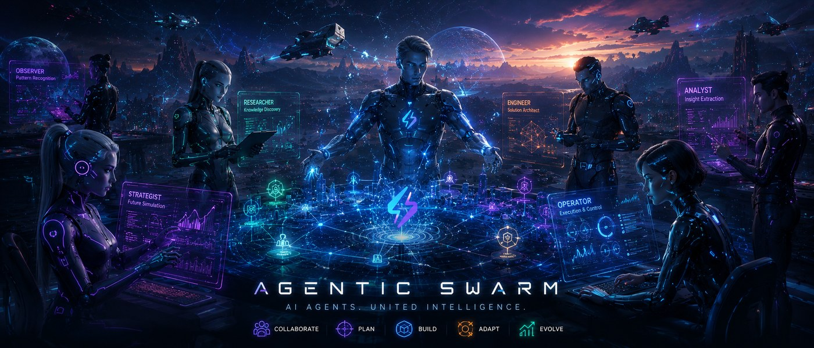
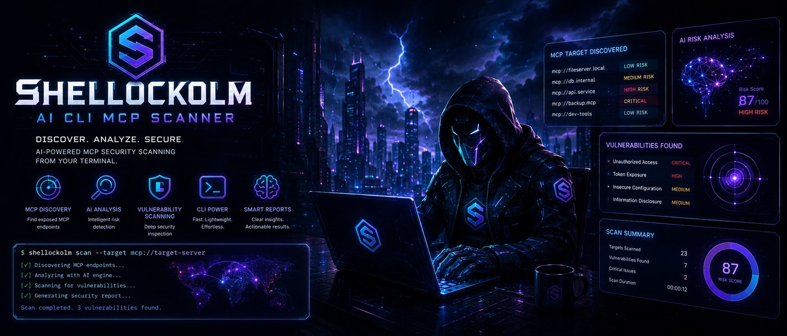
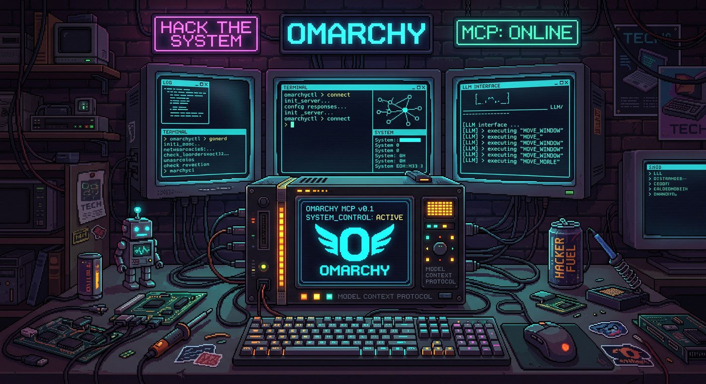
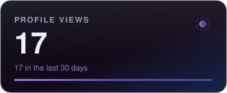

<!-- ══════════════════════ HEADER ══════════════════════ -->

 

<!-- ══════════════════════ WHAT I BUILD ══════════════════════ -->

### What I build

<table>
<tr>
<td width="50%" valign="top">

**🧠 Agent memory**
Memory that survives sessions, compacts and machine swaps — shared across every agent through one endpoint.

</td>
<td width="50%" valign="top">

**🔌 MCP servers**
Gateways, scanners and desktop control — real capabilities for agents, not another wrapper.

</td>
</tr>
<tr>
<td width="50%" valign="top">

**🛡️ Security tooling**
CVE detection, SBOM analysis, OSINT recon and supply-chain audits — defensive by default.

</td>
<td width="50%" valign="top">

**⚙️ Dev experience**
CLIs, dashboards and skill packs that delete glue code instead of adding it.

</td>
</tr>
</table>

<!-- ══════════════════════ FEATURED ══════════════════════ -->

### Featured projects

**[Memorify](https://memorify.dev)** — Agent memory as infrastructure. One MCP endpoint, every agent, zero code changes.
`TypeScript` `Neon` `Netlify` `Clerk`

**[agentic-swarm](https://github.com/hlsitechio/agentic-swarm)** — 60 specialist engineering agents in 10 teams. One command into any AI CLI.
`Python`

**[Shellockolm](https://github.com/hlsitechio/Shellockolm-AI-CLI-MCP-Scanner)** — AI security scanner: MCP endpoint discovery, CVE detection, SBOM analysis, risk scoring.
`Python` `Security`

**[Omarchy MCP](https://github.com/hlsitechio/Omarchy-4-AI-Agent-MCP)** — Full control of an Omarchy Linux desktop for any LLM — themes, tiling, screenshots, audio.
`TypeScript` `Linux`

<b>More projects</b> — memory engine, prompt hygiene, dev cards, commerce tools

 

| Project | What it does | Stack |
|:--|:--|:--|
| **[Memory Engine](https://github.com/hlsitechio/Memory-Engine-Persistent-Memory-for-AI-Coding-Agents)** | Persistent M/C/I memory for coding agents — survives crashes and restarts | `Python` |
| **[ctxscrub](https://github.com/hlsitechio/ctxscrub)** | Scrub secrets and strip bloat before pasting a prompt into an LLM | `TypeScript` |
| **[pinpoint-mcp](https://github.com/hlsitechio/pinpoint-mcp)** | Screenshot capture + visual annotation MCP server (mss, Playwright, Tesseract) | `Python` |
| **[claude-skills-security](https://github.com/hlsitechio/claude-skills-security)** | Defensive security audit skill packs, keyed by tech stack and audit domain | `Shell` |
| **[M.I.C. agents](https://github.com/hlsitechio/mic-agents)** | Three-layer JSON profile format for agents: Memory, Intention, Context | `Python` |
| **[risk-rush](https://github.com/hlsitechio/risk-rush-arcade-shmup)** | Old-school vertical shoot 'em up with arcane pilots and risk/reward upgrades | `TypeScript` |
| **[Vibe Card](https://github.com/hlsitechio)** | Shareable glowing dev cards — profile, pinned repos, yearly glow grid | `React` |
| **[crowbyte](https://github.com/hlsitechio/crowbyte)** | AI-powered cybersecurity terminal — 95+ tools, one window | `TypeScript` |

**[→ all public repositories](https://github.com/hlsitechio?tab=repositories)**

<!-- ══════════════════════ STACK ══════════════════════ -->

### Stack

  
  
  
  
  
  
  
  
  
  
  
  
  
  
  
  

<!-- ══════════════════════ STATS ══════════════════════ -->

### The numbers

  
  

  

<!-- ══════════════════════ FOOTER ══════════════════════ -->

**Building tools that make AI agents actually useful.**

🏷️ Topics I work in

 
AI Agents · Agentic AI · MCP · Model Context Protocol · LLM Tooling · AI Memory · RAG · Vector Search · Embeddings · Prompt Engineering · Developer Experience · CLI · TypeScript · Python · Node.js · Deno · React · Postgres · Neon · Serverless · Edge Functions · Netlify · Clerk · Stripe · Cloudflare · Ollama · Local LLMs · Open Source · Cybersecurity · OSINT · Supply Chain Security · Automation · Indie Hacking · Shopify · Web Apps

